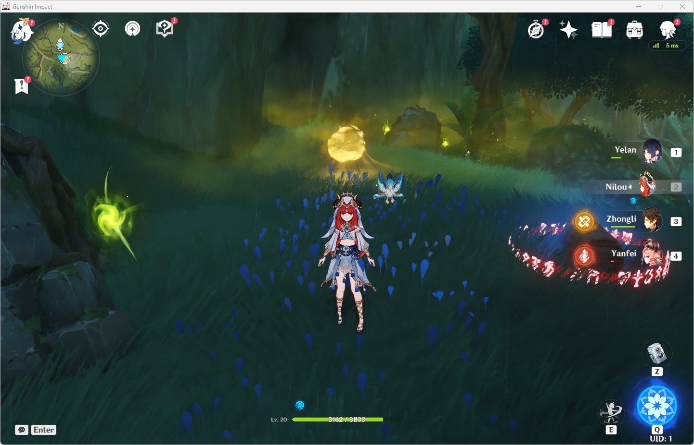
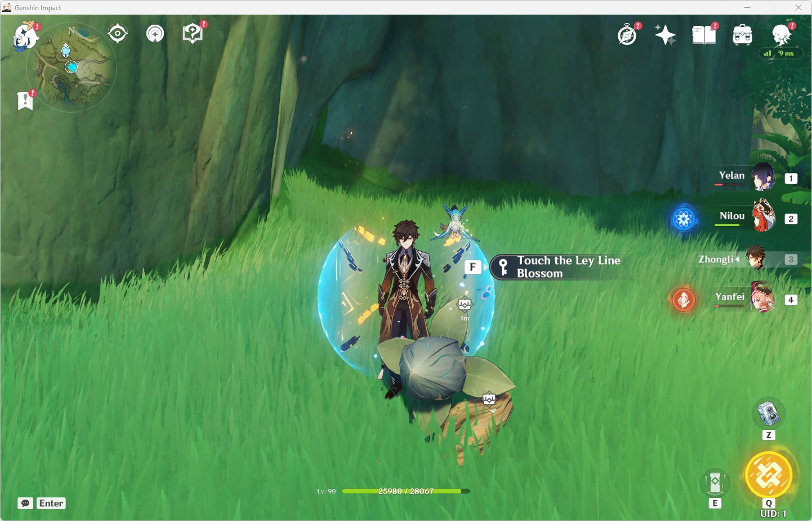
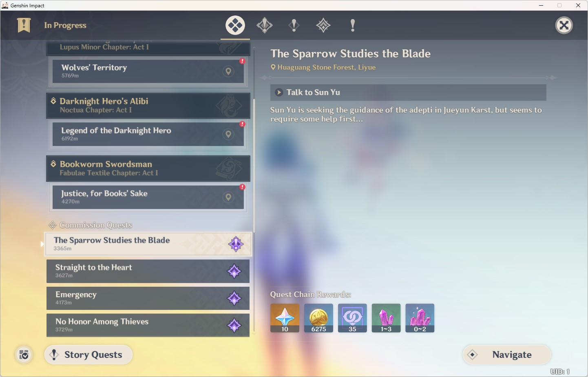
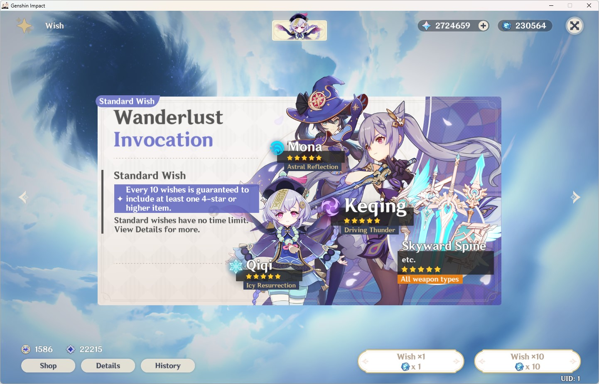
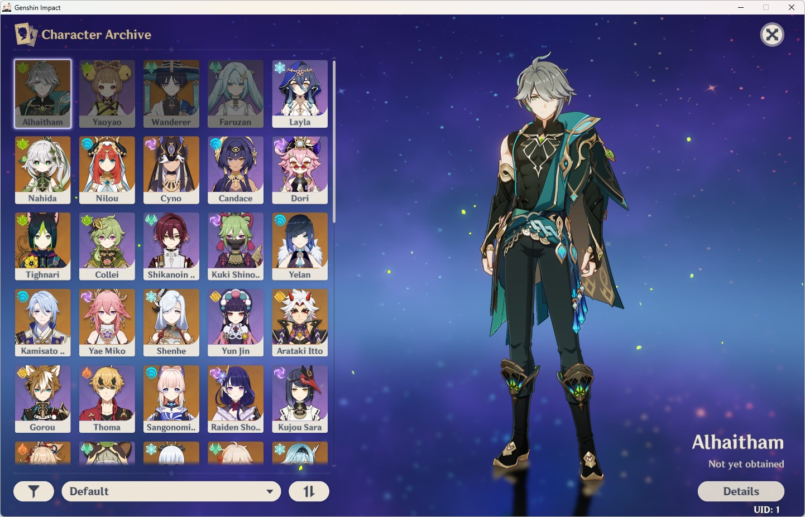
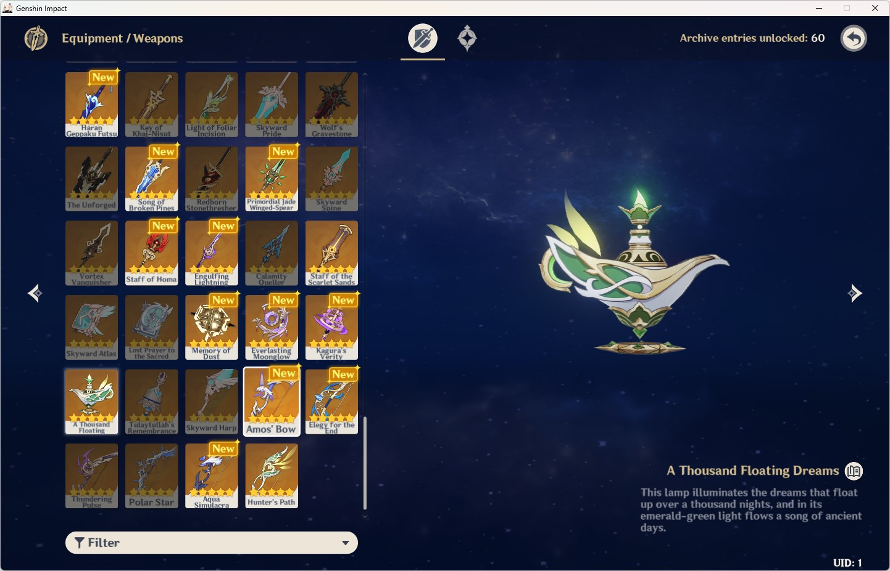
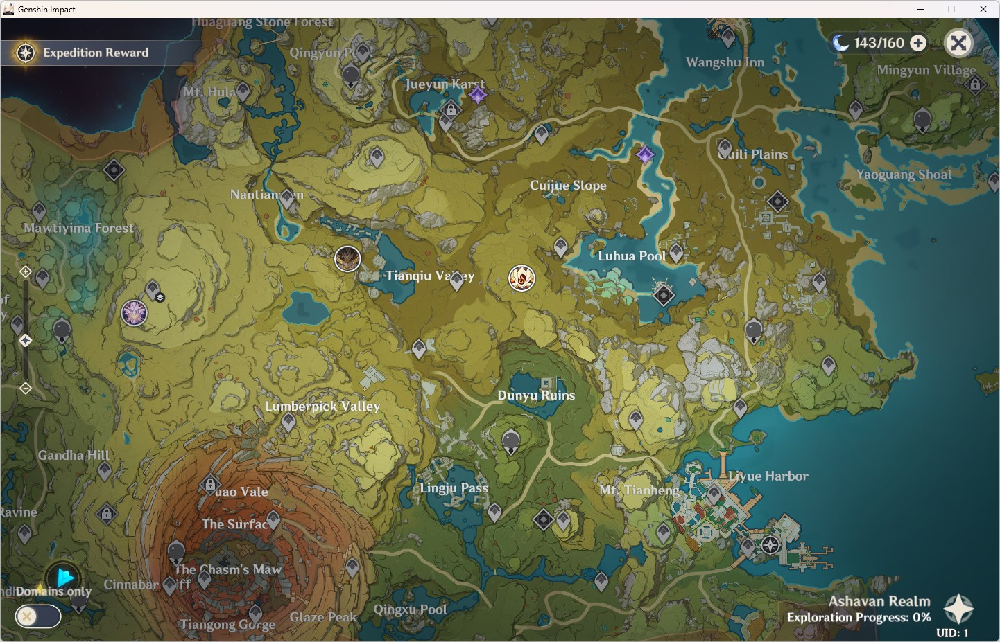
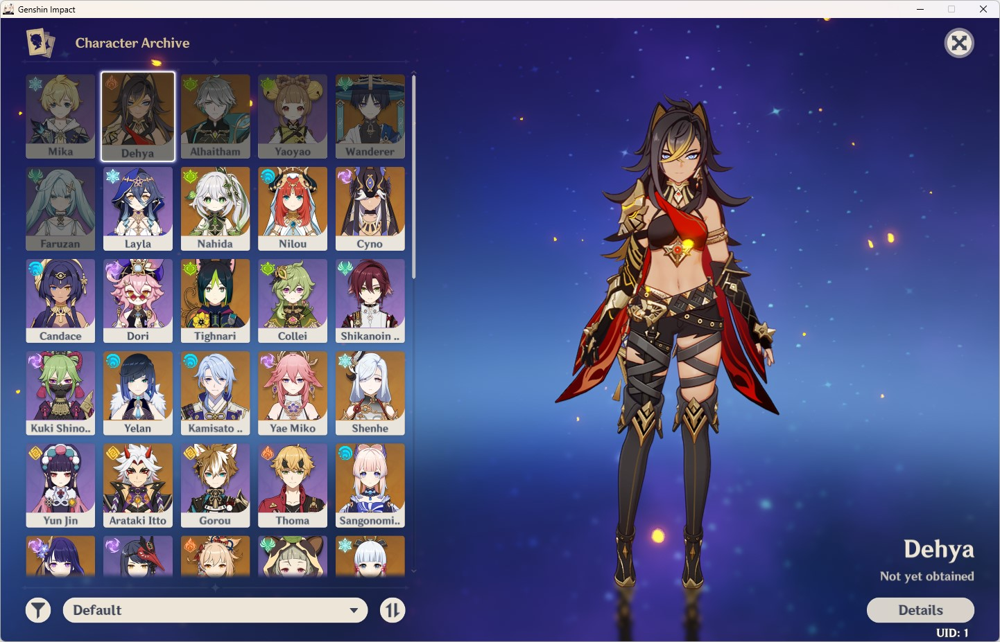
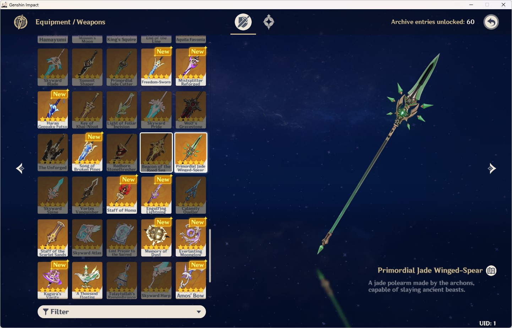

# ViaGenshin

> This project is not a production-ready project, it's just a proof of concept. Use it at your own risk.

Allows the connection of newer clients to older Genshin servers.

## Configuration

- `endpoints.mainEndpoint` - The upstream server `ViaGenshin` will connect to.
- `endpoints.mainProtocol` - The upstream server protocol version.
- `endpoints.mapping` - Map the downstream client protocol version to the `ViaGenshin` listening port.
- `protocols.baseProtocol` - The base protocol version `ViaGenshin` will use.
- `protocols.mapping` - Map the protocol version to its file location.
- `keys.sharedKey` - The shared Ec2b key used to encrypt the first packet, base64 encoded.
- `keys.serverKey` - The server RSA key used to decrypt the client rand, and sign the server rand, pem encoded.

### The `data/mapping` folder

The `data/mapping` folder contains the protocol files and organized in the following way:

- `data/mapping/{{ VERSION }}` - The protocol version.
- `data/mapping/{{ VERSION }}/protocol.csv` - The command name and id mapping.
- `data/mapping/{{ VERSION }}/protocol/*.proto` - The protobuf files.

## Frequently Asked Questions

### The protobuf files?

Grab them from the open and free Internet. Or write them yourself.

### How to get the `sharedKey`?

The `sharedKey` is the database value of the `client_secret_key` column in the `t_region_config` table, or you can get it from the `QueryCurrRegionHttpRsp` response.

### `Ability` and `Combat` are not working?

Your protobuf files are broken, please check them, especially the name starting with `AbilityMeta`, `AbilityMixin`, and `Evt`.
The full check list you can find in the source file `internal/mapper/types.go`.

### About `panic`, `data race`, `memory leak` and `deadlock`?

If you meet any of these, please fix them and submit a pull request. Thanks! If you don't know how to fix them, just simply ignore them and restart the service.

### New features, bug fixes, etc.?

Please submit a pull request. Thanks!

## Some Showcases

Here are some showcases of the `3.4.0 client` connecting to the `3.2.0 server`, aka., the GIO server.

|            |            |            |
| :--------: | :--------: | :--------: |
|  |  |  |
|  |  |  |

More showcases of the `3.5.0 client` connecting to the `3.2.0 server`.

|            |            |            |
| :--------: | :--------: | :--------: |
|  |  |  |
